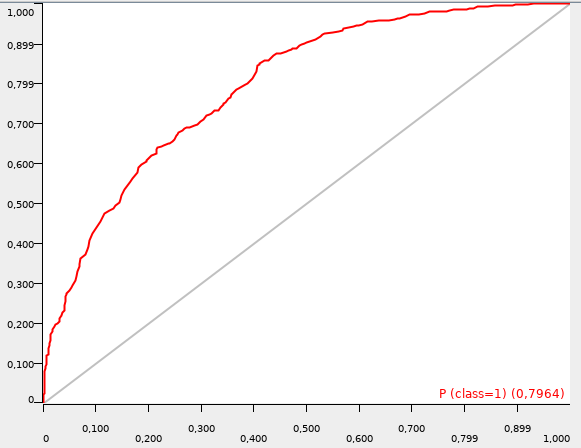

# bayesian-rf-knime-scikit

Bayesian Optimization of RandomForest parameters, with scikit-learn, to be used in KNIME in Python learner node. Based on https://github.com/fmfn/BayesianOptimization/ by fmfn.

Prerequisities:
- `pip install bayesian-optimization`


Why?
1. Parameter Optimization Loop Node(s) doesn't work as expected for some data. Including Bayesian optimization.
2. You may want to use scikit-learn instead of KNIME or Weka implementation.
3. You can tune this workflow to optimize other parameters for many different scikit algorithms.

## Setup

- In python node please select python2.
- copy&paste the python code into the code window of Python Learner (`python-learner.py`) and Python Predictor (`python-predictor.py`)
- sample workflow:


- in the input table, the class should be in the last column
- fine tuning - edit variables at the top of the `python-learner.py`:

```python
#
# Bounded region of parameter space
#

parameterDict = { 'n_estimators': (100, 1200),
            'max_depth': (5, 30),
            'min_samples_split': (2, 100),
            'min_samples_leaf': (1, 10)
            }

#
# bayesian configuration
#

init_points = 5
n_iter = 20
```

- please note: scripts (after slight modifications) can be run from the command line
- sample data file provided (`nr-ahr-lite.csv ` from my [tox21 dataset](https://github.com/filipsPL/tox21_dataset))


## Standard output

Among some training progress data (static) info about best parameters found is displayed:

```
Best params: {'min_samples_split': 2, 'n_estimators': 205, 'max_depth': 30, 'min_samples_leaf': 1}
Best target value: 0.837006427916
```

## ROC output (ROC curve node)


